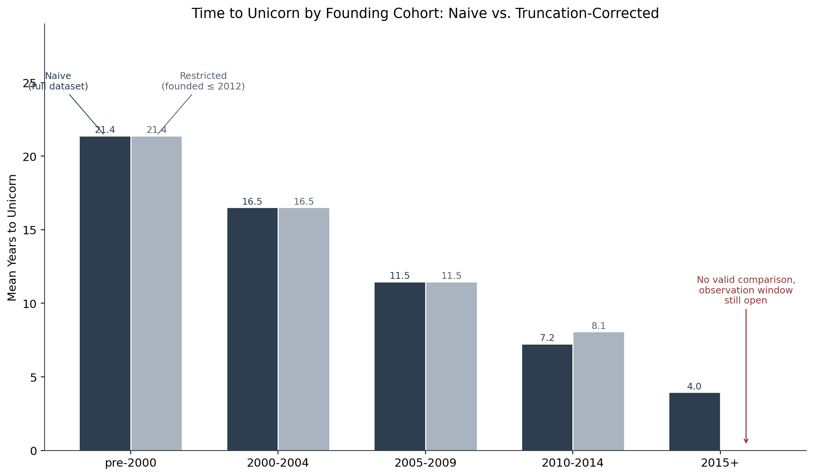

# Unicorn Time to Scale

What predicts how fast a company reaches a one billion dollar valuation, and does the apparent acceleration over time survive scrutiny? This project analyzes 1,073 companies to answer that question, with a specific focus on testing whether the "unicorns are getting faster" trend is real or an artifact of how the data was collected.

This is a living document. Sections below are filled in as the project progresses.

## Data

Source: `data/raw/unicorn_companies.csv`, 1,073 companies at the raw stage.

Target variable: `years_to_unicorn`, computed as the year of `Date Joined` minus `Year Founded`.

## Data Cleaning

Every cleaning decision is documented with its rule and the row count it affected. The raw file is kept untouched in `data/raw/`, cleaned output goes to `data/processed/`.

| Decision | Rule | Rows affected |
|---|---|---|
| Negative durations | Dropped rows where `years_to_unicorn` was negative and unresolvable from available data | 1 (Yidian Zixun: `Year Founded` of 2021 postdates `Date Joined` of 2017, an impossible timeline with no independent source available to correct it) |
| Old company outliers | Excluded companies with `Year Founded` before 1990. A stated rule, not a one off exclusion. The cutoff sits in a genuine gap in the founding year distribution, no company was founded between 1985 and 1989 | 3 (Otto Bock HealthCare, Promasidor Holdings, Five Star Business Finance) |
| Currency parsing | Parsed `Valuation` and `Funding` from strings like `$11B` or `$500M` into numeric dollar values. `Unknown` values in `Funding` were mapped to missing rather than guessed | 12 `Funding` values set to missing |
| Date parsing | Parsed `Date Joined` using an explicit `%m/%d/%y` format and verified every date resolved to the correct century | 0 |
| Country consolidation | Checked all 45 unique values in `Country/Region` for variant spellings before any grouping | 0, none found |

Final row count after cleaning: 1,070, down from 1,073.

## Feature Engineering

| Feature | Definition | Notes |
|---|---|---|
| `founding_cohort` | `Year Founded` banded into pre-2000, 2000-2004, 2005-2009, 2010-2014, 2015+ | Built with `pd.cut`, bin edges chosen so the 1990 cleaning cutoff falls inside the first band |
| `investor_count` | Count of comma-separated names in `Select Investors` | 1 missing value (LinkSure Network) left as missing rather than treated as zero, a company cannot become a unicorn with no backers, so the null reflects an unrecorded value, not an absence |
| `has_top_tier_investor` | Binary flag for whether Sequoia, Andreessen Horowitz, Tiger Global, Accel, SoftBank, Founders Fund, or Insight Partners appears in `Select Investors` | Case-insensitive substring match, list defined explicitly in the notebook. Same missing-value handling as `investor_count` |
| `Industry` (cleaned) | Standardized casing before use | Found and fixed a duplicate category: `Artificial intelligence` and `Artificial Intelligence` were being treated as separate industries due to inconsistent capitalization |
| `industry_grouped` | Industries representing less than 3% of the dataset folded into `Other` | Reduces 15 raw categories to 11, avoids one-hot encoded columns and tree splits built on a handful of rows. Folded: Auto & transportation, Edtech, Consumer & retail, Travel |
| `continent_grouped` | Same 3% rule applied to `Continent` | Reduces 6 categories to 4. Folded: South America, Oceania, Africa |
| `valuation_numeric` | Parsed from `Valuation`, see Data Cleaning | Descriptive use, not a model input, see the leakage note below |

`Country/Region` is kept in its raw, ungrouped form and is not used for modeling. Geography for modeling is represented by `continent_grouped`; the raw country column is reserved for the descriptive MENA section.

`Funding` (parsed as `funding_numeric`) is excluded from modeling entirely. It is downstream of the outcome and would leak information about the target. It may appear in a descriptive context only.

## Exploratory Data Analysis

To be documented.

## Truncation Bias

### The naive result

Grouping `years_to_unicorn` by `founding_cohort` and averaging shows a sharp downward trend:

| Cohort | Mean years to unicorn |
|---|---|
| pre-2000 | 21.4 |
| 2000-2004 | 16.5 |
| 2005-2009 | 11.5 |
| 2010-2014 | 7.2 |
| 2015+ | 4.0 |

At face value, this says unicorns are getting dramatically faster to build.

### Why it is partly illusory

This dataset only contains companies that have already reached $1B, and only as of when it was collected. The most recent `Date Joined` in the data is April 5, 2022, so the dataset was scraped shortly after that date, meaning no company can appear here for having crossed the $1B line after that point.

This creates **right-truncation**: survivorship bias within an incomplete observation window. A company founded in 1995 has had about 27 years to cross the $1B threshold by 2022, enough time for essentially every unicorn from that cohort, fast or slow, to have already appeared. A company founded in 2020 has had at most 2 years, so only its fastest possible movers could have already qualified. Any 2020-founded company that will take 5, 8, or 10 years to scale is still invisible in this dataset right now, not because it failed, but because it has not had time yet.

The consequence: the average computed for recent cohorts only reflects their fastest-scaling members, since the slower ones have not shown up yet. This systematically pulls recent-cohort averages down, which is what produces the sharp naive slope above. Some of that apparent acceleration is real; some of it is an artifact of missing data on companies still in progress.

### Correction

Of the two approaches the plan allows, cohort restriction is used here rather than fitting and comparing two full models, it is simpler and easier to state plainly: "only companies that all had roughly the same amount of time to qualify are being compared."

**Rule:** keep only companies founded on or before 2012. Since the dataset's collection cutoff is April 2022, this gives every remaining company roughly 10 years to have reached $1B.

**Limitation, stated honestly:** `Year Founded` is a whole year, not an exact date, so "founded 2012" could mean January 2012 (about 10 years 3 months by April 2022) or December 2012 (about 9 years 4 months). The rule gives roughly 10 years, not a guaranteed exact 10 for every row. This is a minor, second-order imprecision, a few months, on windows spanning a decade or more, and is not comparable in scale to the original truncation problem it is fixing, which was the difference between a 1-year window and a 27-year window.

### What survives

| Cohort | Naive mean | Restricted mean |
|---|---|---|
| pre-2000 | 21.4 | 21.4 |
| 2000-2004 | 16.5 | 16.5 |
| 2005-2009 | 11.5 | 11.5 |
| 2010-2014 | 7.2 | 8.1 |
| 2015+ | 4.0 | cannot be evaluated, no companies founded after 2012 have had a full window yet |

Two things stand out. First, the `2010-2014` mean rose from 7.2 to 8.1 once the still-partially-observed 2013-2014 companies were removed. This is a direct, concrete confirmation of the truncation mechanism: removing companies that have not had time to finish scaling raises the average, because it is disproportionately the fast movers who show up early, and this was exactly the effect inflating the naive figure downward.

Second, and more importantly, the naive chart's most dramatic data point, `2015+` averaging just 4.0 years, cannot be reproduced under a fair comparison at all. No company founded after 2012 has had enough time yet to be judged on equal footing with the older cohorts, so that number should never have been presented as a real finding.

**What survives:** a real downward trend across `pre-2000` through `2010-2014` (21.4 to 16.5 to 11.5 to 8.1). Companies are still reaching unicorn status meaningfully faster than they did before 2000, even after correcting for the observation window. The acceleration is real, but it is smaller and slower than the naive chart implied, and the naive chart's sharpest-looking claim was substantially an artifact.

**Interview sentence:** the naive result said unicorns are getting faster. Most of the sharpest part of that result was truncation bias, because recent slow-scaling companies are not in the dataset yet. After restricting to cohorts with a full observation window, a real but more moderate acceleration remained, from 21.4 years before 2000 to 8.1 years for 2010-2014.

## Modeling

To be documented.

## MENA Region

To be documented.
